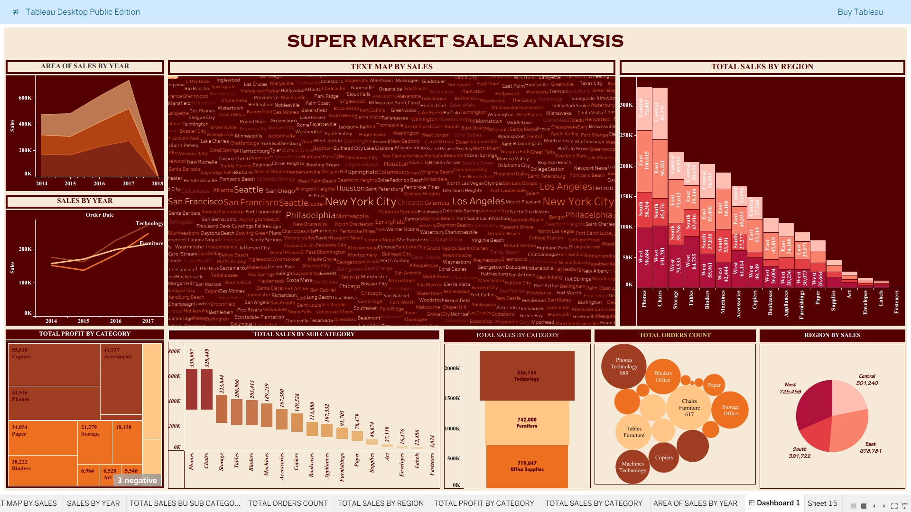

# Supermarket Sales Analysis | Tableau Dashboard

## 📊 Project Overview
An interactive Tableau dashboard designed to analyse supermarket sales performance across regions, categories, and time periods.

## 🎯 Business Objectives
- Track year-wise sales trends
- Identify high-performing categories & sub-categories
- Analyse regional sales contribution
- Understand order volume and profitability

## 📌 Key Insights
- Technology category generates the highest sales
- West region leads in overall revenue
- Phones and Chairs are top-performing sub-categories
- Sales show consistent year-on-year growth

## 🛠 Tools & Technologies
- Tableau Public
- Microsoft Excel
- Data Visualization & Analytics

## 🔗 Live Dashboard
👉 https://public.tableau.com/app/profile/abrar.ahamed7210/viz/SUPERMARKETSALESANALYSISEXPORTPACKAGEWORKBOOK/Dashboard1

## 👤 Author
**Abrar Ahamed**  
Aspiring Data Analyst | MSc Data Science (UK – 2026)
